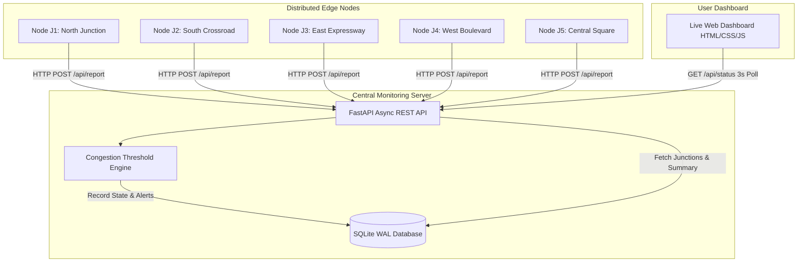

# Distributed Traffic Monitoring Application
> **Academic Distributed Computing Project** | Demonstrating **Distributed Sensing & Monitoring**, **Node Autonomy**, **Asynchronous Server Concurrency**, and **Threshold Alerting**.

---

## 📌 Project Overview

This application simulates a distributed network of smart traffic monitoring sensors/cameras deployed across independent road junctions. Each node operates autonomously, collecting localized traffic metrics (vehicle count, average speed, weather condition) and periodically pushing telemetry over HTTP/REST to a central monitoring aggregator server. The server concurrently processes incoming node reports, updates a thread-safe database, evaluates traffic congestion thresholds, and serves a live web dashboard.

---

## 🏛️ System Architecture Diagram

### 1. Visual ASCII Block Diagram
```
+-----------------------------------------------------------------------------------+
|                              DISTRIBUTED EDGE LAYER                               |
|                                                                                   |
|  [ Node J1: North ]   [ Node J2: South ]   [ Node J3: East ]   [ Node J4: West ]  |
|  (Camera/Sensor)      (Camera/Sensor)      (Camera/Sensor)     (Camera/Sensor)    |
|         |                    |                    |                   |           |
|  HTTP POST /api/report       |                    |                   |           |
|  (Interval: 3s)              |                    |                   |           |
+---------+--------------------+--------------------+-------------------+-----------+
          |                    |                    |                   |
          v                    v                    v                   v
+-----------------------------------------------------------------------------------+
|                        CENTRAL MONITORING AGGREGATOR LAYER                        |
|                                                                                   |
|                    FastAPI + Uvicorn Async / Multithread Server                   |
|                   +--------------------------------------------+                  |
|                   | POST /api/report  (Concurrent Ingestion)   |                  |
|                   | GET  /api/status  (Dashboard Polling API)  |                  |
|                   | GET  /api/history (Time-series Graph Data) |                  |
|                   | GET  /api/alerts  (Congestion Event Logs)  |                  |
|                   +---------------------+----------------------+                  |
|                                         |                                         |
+-----------------------------------------+-----------------------------------------+
                                          |
                   +----------------------+----------------------+
                   |                                             |
                   v                                             v
+------------------------------------+        +-------------------------------------+
|        DATABASE STORAGE            |        |           LIVE DASHBOARD            |
|                                    |        |                                     |
|    SQLite Database (WAL Mode)      |        |   Glassmorphism Web Dashboard       |
|  - junctions (Latest Node State)   | <===== |   - Real-time KPI Metric Cards      |
|  - traffic_reports (Time-Series)   |        |   - Live Junction Status Grid       |
|  - congestion_alerts (Alert Logs)  |        |   - Chart.js Multi-Node Graphs      |
+------------------------------------+        |   - Streaming Node Telemetry Ticker |
                                              +-------------------------------------+
```

### 2. Mermaid Sequence & Architecture Diagram


---

## 🔬 Distributed Computing Concepts Demonstrated

| Concept | Implementation Location | Explanation for Academic Report / Video |
| :--- | :--- | :--- |
| **Distributed Monitoring & Sensing** | [`node/node_simulator.py`](file:///C:/Users/Dhivya/.gemini/antigravity/scratch/distributed_traffic_monitoring/node/node_simulator.py#L31-L120) | Traffic monitoring is decentralized across independent edge camera processes rather than relying on a single central camera. Nodes sense local state independently. |
| **Node Autonomy & Loose Coupling** | [`node/node_simulator.py`](file:///C:/Users/Dhivya/.gemini/antigravity/scratch/distributed_traffic_monitoring/node/node_simulator.py#L130-L150) | Each node runs in its own execution thread/container without central synchronization. Nodes communicate exclusively via standard HTTP REST API contracts. |
| **Fault Tolerance & Resilience** | [`node/node_simulator.py`](file:///C:/Users/Dhivya/.gemini/antigravity/scratch/distributed_traffic_monitoring/node/node_simulator.py#L95-L125) | Nodes use retry mechanisms with exponential backoff. If the central server drops offline, nodes continue operating locally without crashing and resume transmission once restored. |
| **Server Concurrency Handling** | [`server/main.py`](file:///C:/Users/Dhivya/.gemini/antigravity/scratch/distributed_traffic_monitoring/server/main.py#L65-L100) | Built on FastAPI and Uvicorn thread pools. The server accepts concurrent POST payloads from multiple nodes simultaneously without request queuing or thread starvation. |
| **Thread-Safe Data Persistence** | [`server/database.py`](file:///C:/Users/Dhivya/.gemini/antigravity/scratch/distributed_traffic_monitoring/server/database.py#L20-L40) | SQLite configured with Write-Ahead Logging (`WAL` mode) allowing multiple concurrent node write streams while simultaneously handling non-blocking read queries from the dashboard. |
| **Central Data Aggregation & Threshold Alerting** | [`server/analytics.py`](file:///C:/Users/Dhivya/.gemini/antigravity/scratch/distributed_traffic_monitoring/server/analytics.py#L15-L75) | Aggregates localized telemetry streams into global system health metrics. Detects high congestion spikes based on rule-based vehicle count and speed thresholds (`Low`, `Medium`, `High`). |

---

## 📂 Project Structure

```
distributed_traffic_monitoring/
├── node/
│   └── node_simulator.py      # Independent node simulator (parameterized CLI script)
├── server/
│   ├── __init__.py
│   ├── database.py            # Thread-safe SQLite DB layer (WAL mode)
│   ├── analytics.py           # Congestion classifier & network aggregation
│   └── main.py                # FastAPI REST API server & static file host
├── dashboard/
│   ├── index.html             # Real-time visual monitoring dashboard
│   ├── css/
│   │   └── styles.css         # Modern dark-mode glassmorphism styling
│   └── js/
│       └── app.js             # Live polling, Chart.js graphs, log stream, surge trigger
├── docker/
│   ├── Dockerfile.server      # Server container image spec
│   ├── Dockerfile.node        # Node simulator container image spec
│   └── docker-compose.yml     # Multi-container orchestrator (1 server + 5 nodes)
├── docker-compose.yml         # Root docker-compose shortcut
├── requirements.txt           # Python dependencies
└── README.md                  # Project documentation & Distributed Computing guide
```

---

## 🚀 How to Run the Application

### Option A: Running Containerized via Docker Compose (Recommended)

Running via Docker Compose demonstrates **true distributed container isolation**, where each node and the server execute in separate OS containers connected over a virtual container network.

1. **Build and Start All Containers**:
   ```bash
   docker-compose up --build
   ```

2. **Access the Application**:
   - Web Dashboard: Open [http://localhost:8000](http://localhost:8000) in your browser.
   - Interactive API Docs (Swagger): Open [http://localhost:8000/docs](http://localhost:8000/docs).

3. **Observe Distributed Container Activity**:
   You will see 5 node containers (`node-north-junction`, `node-south-crossroad`, etc.) starting independently and POSTing telemetry to `central-monitoring-server` over the Docker network.

4. **Stop the Network**:
   ```bash
   docker-compose down
   ```

---

### Option B: Running Locally with Python Scripts

If you do not have Docker installed, you can launch the server and multiple independent node processes in separate terminal windows.

#### Step 1: Install Dependencies
```bash
pip install -r requirements.txt
```

#### Step 2: Start Central Monitoring Server
```bash
python -m server.main
```
*The server will start at `http://localhost:8000` and initialize the SQLite database.*

#### Step 3: Launch Multiple Independent Node Processes
Open separate terminal windows and run the node simulator script with different junction parameters:

- **Terminal 2 (Node 1 - North Junction)**:
  ```bash
  python node/node_simulator.py --junction-id J1 --name "North Junction" --interval 3
  ```

- **Terminal 3 (Node 2 - South Crossroad)**:
  ```bash
  python node/node_simulator.py --junction-id J2 --name "South Crossroad" --interval 3
  ```

- **Terminal 4 (Node 3 - East Expressway)**:
  ```bash
  python node/node_simulator.py --junction-id J3 --name "East Expressway" --interval 4
  ```

- **Terminal 5 (Node 4 - West Boulevard)**:
  ```bash
  python node/node_simulator.py --junction-id J4 --name "West Boulevard" --interval 3
  ```

- **Terminal 6 (Node 5 - Central Square)**:
  ```bash
  python node/node_simulator.py --junction-id J5 --name "Central Square" --interval 5
  ```

#### Step 4: Open Live Dashboard
Open [http://localhost:8000](http://localhost:8000) in your web browser.

---

## 🎯 Demonstration & Testing Features

1. **Live Junction Status Cards**: Shows color-coded congestion badges (`Low` = Green, `Medium` = Amber, `High` = Red) based on live node reports.
2. **Interactive Traffic Surge Trigger**: Click the **"Simulate Traffic Surge"** button on any junction card in the dashboard. This immediately injects a heavy traffic spike into that junction node to test how the central server detects congestion and triggers a real-time alert!
3. **Real-time Log Ticker Stream**: Displays raw telemetry heartbeats arriving from nodes with sequence numbers and node IDs.
4. **Multi-Node Chart.js Graph**: Toggle between **Speed (km/h)** and **Vehicle Count** time-series views.

---

## 📝 Code Annotations Summary for Report & Presentation

When presenting or recording your video demonstration, highlight these specific files and sections:

1. **`node/node_simulator.py` (Line 95)**: Show how nodes handle connection timeouts and server retries gracefully using backoff loops without crashing.
2. **`server/database.py` (Line 25)**: Point out `PRAGMA journal_mode=WAL;` to explain how thread-safe concurrent database access is achieved.
3. **`server/main.py` (Line 65)**: Show `@app.post("/api/report")` and explain how Uvicorn processes incoming requests concurrently across worker threads.
4. **`server/analytics.py` (Line 15)**: Explain the threshold logic (`vehicle_count >= 60` or `avg_speed_kmh < 20.0`) used to trigger congestion alerts.
# distributed_traffic_monitoring

